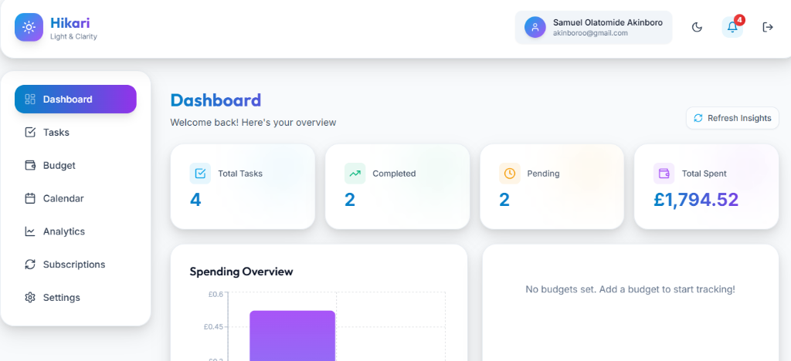

# Hikarii (Light & Clarity)

**Hikarii** is a premium, productivity-focused web application designed to bring light and clarity to your tasks and finances. It combines a robust task tracker with an intuitive budget manager, powered by intelligent insights to help you stay on top of your game.



---

## 💡 Why Hikarii Stands Out

Hikarii isn't just another budget tracker. It is built for **Project-Centric Users** who need clarity on specific goals—whether it's a home renovation, a wedding, or a startup launch.

### 🎯 1. Project-Centric Focus

Manage specific goals with dedicated timelines and budgets. No more mixing your "Vacation Fund" with your "Groceries".

### ✨ 2. Visual Clarity

A "Light & Clarity" theme that goes beyond aesthetics. Accessible color coding, motivational progress visualization, and a dashboard designed to show status at a glance.

### 🤖 3. Intelligence & Actionable Insights

We don't just say "Spend less". Hikarii gives you proactive, AI-driven guidance.

|                     **Financial Intelligence**                     |                      **Smart Task Management**                       |
| :----------------------------------------------------------------: | :------------------------------------------------------------------: |
|                        |                 |
| **"Switch phone carriers to save NGN 15,000/year based on usage"** | **"Split this complex task into smaller, manageable steps with AI"** |

---

## 🌟 Key Features

### 📝 Task Management

- **Smart AI Split**: Automatically decompose complex tasks into sub-tasks using Google Gemini AI.
- **Visual Organization**: Categorize (Work, Personal, etc.) and prioritize (High to Low).
- **Interactive Status**: Track progress with To-Do, In Progress, and Completed states.
- **Overdue Alerts**: Stay on track with automated visual indicators and email nudges.

### 💰 Financial Integration

- **Smart Budgeting**: Set categorical limits (Monthly, Weekly, or Daily).
- **Multi-Currency Support**: Switch between **NGN, USD, GBP, and EUR** with real-time conversion.
- **Task-Expense Linking**: Attach costs directly to tasks for precise project tracking.
- **Visual Analytics**: Interactive charts showing spending vs. budget in real-time.

### 🔒 Security & Accounts

- **Secure Authentication**: JWT-based auth with secure credential handling.
- **Stripe Integration**: Professional subscription management with **14-day free trials** and Monthly/Yearly options.
- **Profile Customization**: Manage your name, password, and subscription tier with ease.

---

## 🛠️ Tech Stack

### Frontend

- **Framework**: React 18 (Vite) / TypeScript
- **Styling**: Tailwind CSS (Custom "Hikarii" Design System)
- **State**: Zustand
- **Icons**: Lucide React / Recharts

### Backend

- **Runtime**: Node.js & Express / TypeScript
- **Database**: MongoDB (via Prisma ORM)
- **AI Engine**: Google Gemini API
- **Payments**: Stripe CLI / API
- **Email**: Resend

---

## 🚀 Getting Started

### Prerequisites

- Node.js (v18+)
- MongoDB (Local or Atlas)
- npm or yarn

### Installation

1. **Clone & Install**:

   ```bash
   git clone https://github.com/yourusername/Hikarii.git
   cd Hikarii
   npm install && cd server && npm install && cd ..
   ```

2. **Environment Setup**:
   Create a `.env` in the `server/` directory:

   ```env
   PORT=5000
   DATABASE_URL="mongodb://localhost:27017/Hikarii"
   JWT_SECRET="your_secret"
   RESEND_API_KEY="re_..."
   STRIPE_SECRET_KEY="sk_..."
   GEMINI_API_KEY="AIza..."
   ```

3. **Database Refresh**:

   ```bash
   npm run db:push
   ```

4. **Run Development**:
   ```bash
   npm run dev
   ```

---

## 🤝 Contributing

1. Fork the repository.
2. Create a feature branch (`git checkout -b feature/AmazingFeature`).
3. Commit and push.

## 📄 License

Distributed under the MIT License. See `LICENSE` for more information.
