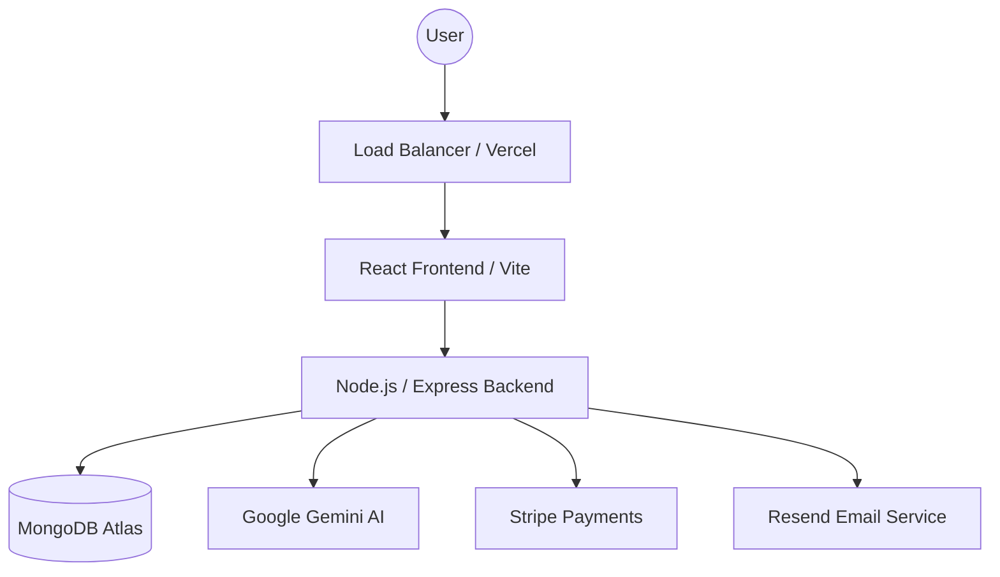
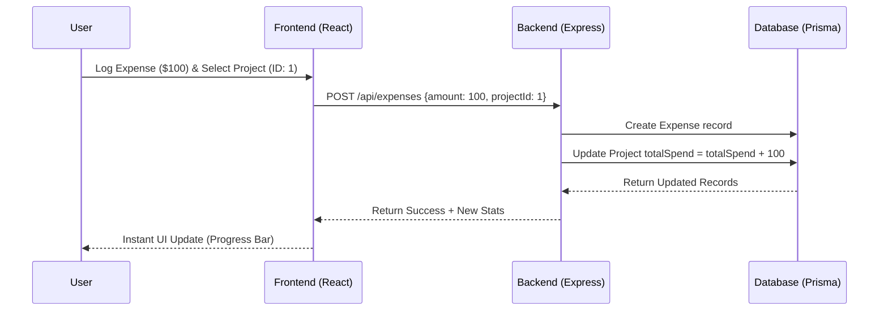
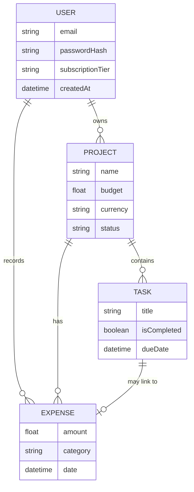

# Enterprise Product Requirements Document (PRD): Hikari ⛩️✨

**Project Code Name:** HIKARI-2026  
**Document Version:** 2.0 (Enterprise Gold)  
**Status:** Approved for Engineering  
**Confidentiality:** Internal Only  
**Owner:** Product Strategy & Architecture  

---

## TABLE OF CONTENTS
1. [Executive Summary](#1-executive-summary)
2. [Market Analysis & Competitive Landscape](#2-market-analysis--competitive-landscape)
3. [The Hikari Method: Core Philosophy](#3-the-hikari-method-core-philosophy)
4. [User Segmentation & Personas](#4-user-segmentation--personas)
5. [System Architecture & Data Flow](#5-system-architecture--data-flow)
6. [Functional Requirements (Deep Dive)](#6-functional-requirements-deep-dive)
7. [API & Integration Specifications](#7-api--integration-specifications)
8. [Entity Relationship Diagram (ERD)](#8-entity-relationship-diagram-erd)
9. [UI/UX Design System & Component Library](#9-uiux-design-system--component-library)
10. [Non-Functional Requirements (SLA & Compliance)](#10-non-functional-requirements-sla--compliance)
11. [Analytics & Telemetry Schema](#11-analytics--telemetry-schema)
12. [Operational Playbook & Deployment](#12-operational-playbook--deployment)
13. [Future Roadmap & v3.0 Planning](#13-future-roadmap--v30-planning)
14. [Appendix: Glossary & Error Codes](#14-appendix-glossary--error-codes)

---

## 1. EXECUTIVE SUMMARY

### 1.1 Project Mission
Hikari is an ultra-premium, AI-augmented productivity ecosystem designed to bridge the structural gap between **Task Execution** and **Capital Management**. In a market saturated with "dumb" lists and "isolated" banking apps, Hikari provides the first unified "Contextual Finance" platform.

### 1.2 Value Proposition
By directly linking financial transactions to task-level progress, Hikari provides users with **Return on Energy (ROE)** and **Return on Investment (ROI)** metrics that were previously only available to enterprise-grade PMOs.

---

## 2. MARKET ANALYSIS & COMPETITIVE LANDSCAPE

### 2.1 The "Silo" Problem
Current users are forced to context-switch between:
- **Task Managers:** (Todoist, Trello, Notion) - Great for work, zero visibility into costs.
- **Budgeting Apps:** (YNAB, Mint, Rocket Money) - Great for transactions, zero visibility into *why* the money was spent.

### 2.2 Hikari's Strategic Moat
Hikari's "linking logic" creates a high-retention environment where the data becomes more valuable over time. The "AI Smart Split" reduces the friction of project planning, which is the #1 reason users abandon productivity tools.

---

## 3. THE HIKARI METHOD: CORE PHILOSOPHY

### 3.1 Pillar 01: Clarity (The Unified Vault)
Every thought, task, and dollar must live in one secure vault. Fragmentation leads to stress; unification leads to clarity.

### 3.2 Pillar 02: Focus (15-Minute Blocks)
Using Gemini AI to decompose "Mountain Tasks" into actionable blocks. If a task takes >30 mins, it's a project, not a task.

### 3.3 Pillar 03: Freedom (ROI Tracking)
Wealth is built through intentionality. Every dollar spent must be "assigned" to a task-level outcome.

---

## 4. USER SEGMENTATION & PERSONAS

### 4.1 Persona A: "The Solopreneur" (Marcus)
- **Pain:** Managing 5 client projects with varying budgets and deadlines.
- **Goal:** See real-time profit margin per project as tasks are completed.

### 4.2 Persona B: "The Goal-Oriented Saver" (Elena)
- **Pain:** Saving for a wedding but losing track of "hidden" costs.
- **Goal:** A clear countdown of "Tasks Remaining" vs. "Budget Remaining."

---

## 5. SYSTEM ARCHITECTURE & DATA FLOW

### 5.1 High-Level Architecture

### 5.2 Sequence Diagram: Task-Expense Linking

---

## 6. FUNCTIONAL REQUIREMENTS (DEEP DIVE)

### 6.1 Unified "Dump" Inbox (FR-101)
- **Description:** A global, low-friction input field accessible from any view.
- **Input Types:** Text (Standard), Voice-to-Text (Future), Image-to-Task (OCR Future).
- **Processing:** Items tagged as `Unstructured`. User can "Sort" items into Projects, Tasks, or Expenses with one click.

### 6.2 AI Smart Split (FR-201)
- **Description:** Decomposition engine powered by Google Gemini.
- **Workflow:**
    1. User provides Project Title (e.g., "Build a Backyard Deck").
    2. System sends prompt to Gemini requesting JSON output of 5-10 sub-tasks.
    3. User reviews suggestions in a "Draft" state.
    4. Upon confirmation, the system creates the Project and all sub-tasks in a single transaction.

### 6.3 Financial Engine (FR-301)
- **Multi-Currency:** Dynamic conversion using a cached exchange rate table updated every 24 hours.
- **Budget Gating:** Soft-caps on project spending. If `spent > 90% of budget`, trigger an "AI Warning" insight.

---

## 7. API & INTEGRATION SPECIFICATIONS

### 7.1 Core Endpoints
| Method | Endpoint | Description | Auth Required |
| :--- | :--- | :--- | :--- |
| `POST` | `/api/auth/register` | User signup & trial initialization. | No |
| `GET` | `/api/dashboard` | Aggregated view of tasks/finances. | Yes |
| `POST` | `/api/ai/split` | Triggers Gemini task decomposition. | Yes (Premium) |
| `PATCH` | `/api/projects/:id/link` | Connects a transaction to a project. | Yes |

### 7.2 Data Dictionary (Project Model)
- `id`: UUID (Primary Key)
- `userId`: UUID (Foreign Key)
- `name`: String (Max 100 chars)
- `totalBudget`: Float
- `currency`: Enum (USD, NGN, GBP, EUR)
- `status`: Enum (Planned, Active, Completed, Paused)

---

## 8. ENTITY RELATIONSHIP DIAGRAM (ERD)

---

## 9. UI/UX DESIGN SYSTEM & COMPONENT LIBRARY

### 9.1 Design Principles
- **Clarity:** High contrast, breathable whitespace, typography-first.
- **Premium:** Glassmorphism effects, subtle gradients (Indigo to Purple).
- **Control:** Interactive progress bars that respond to hover states.

### 9.2 Color Palette
- **Primary:** `#6366F1` (Indigo 500)
- **Secondary:** `#A855F7` (Purple 500)
- **Surface:** `#080910` (Dark Mode Core)
- **Accent:** `#10B981` (Emerald 500 - Success/Profit)

---

## 10. NON-FUNCTIONAL REQUIREMENTS (SLA & COMPLIANCE)

### 10.1 Availability & Recovery
- **Uptime SLA:** 99.95% (excluding scheduled maintenance).
- **RTO (Recovery Time Objective):** 4 hours.
- **RPO (Recovery Point Objective):** 15 minutes (Database log-shipping).

### 10.2 Security Headers
- `Content-Security-Policy`: Strict frame-ancestors.
- `Strict-Transport-Security`: Max-age 1 year.
- `X-Frame-Options`: DENY.

### 10.3 Compliance (GDPR/NDPR)
- Right to Erasure: Automated script to purge all user-linked PII within 48 hours of request.
- Data Residency: Ability to select region (EU, US, AF) for database storage (v3.0).

---

## 11. ANALYTICS & TELEMETRY SCHEMA

| Event Name | Properties | Trigger |
| :--- | :--- | :--- |
| `task_completed` | `taskId`, `projectId`, `isAIGenerated` | User checks a task box. |
| `expense_linked` | `amount`, `projectId`, `category` | User links expense to project. |
| `ai_split_triggered` | `promptLength`, `resultCount` | User clicks "Smart Split". |
| `subscription_upgrade` | `tier`, `isAnnual` | User completes Stripe checkout. |

---

## 12. OPERATIONAL PLAYBOOK & DEPLOYMENT

### 12.1 Deployment Pipeline (CI/CD)
1. **Linting & Type Check:** ESLint + TypeScript `tsc`.
2. **Automated Testing:** Jest for backend, Playwright for E2E.
3. **Staging:** Automatic deploy to `staging.hikari.com` on merge to `develop`.
4. **Production:** Manual approval to `main` with blue-green deployment on Vercel.

### 12.2 Incident Response (Severity levels)
- **SEV-1:** Core API down (Dashboards blank). Response time < 15 mins.
- **SEV-2:** Payments/AI Split failing. Response time < 1 hour.
- **SEV-3:** UI glitches, minor bug reports. Response time < 24 hours.

---

## 13. FUTURE ROADMAP & V3.0 PLANNING

### 13.1 Hikari for Teams (v2.5)
- Shared project workspaces.
- Role-Based Access Control (RBAC): View-only vs. Editor.
- Team-wide budget visibility.

### 13.2 Automated Banking (v3.0)
- Plaid/Mono integration for automatic transaction fetching.
- AI-categorization of bank transactions into Hikari Projects.

---

## 14. APPENDIX: GLOSSARY & ERROR CODES

### 14.1 Glossary
- **Linking:** The act of assigning a financial debit to a logical task-unit.
- **ROE (Return on Energy):** A calculated metric showing project progress vs. time spent.
- **The Vault:** The encrypted database storing user financial metadata.

### 14.2 Common Error Codes
- `HIK-401`: Unauthorized access to financial record.
- `HIK-503`: Gemini AI service timeout.
- `HIK-402`: Premium subscription required for this action.
